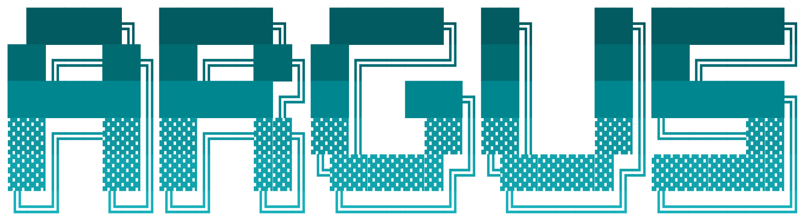
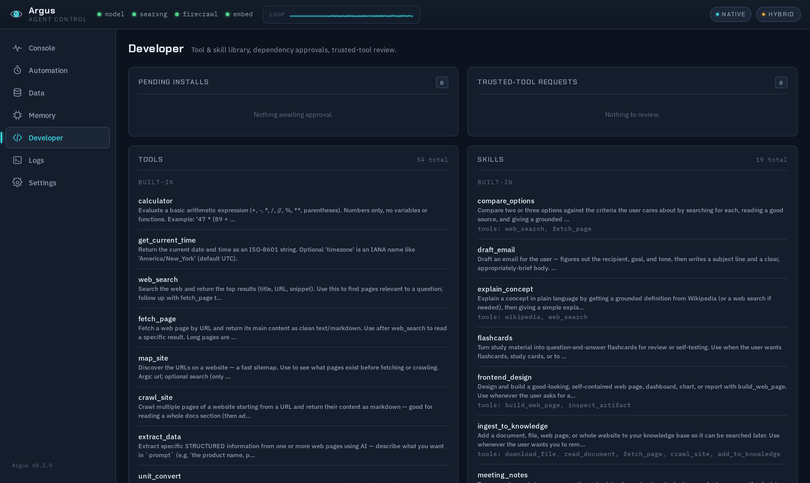

<p align="center">
  <picture>
    <source media="(prefers-color-scheme: dark)" srcset="docs/argus-logo-dark.png">
    
  </picture>
</p>

<p align="center">
  <a href="https://github.com/apollo-orbit-dev/argus-agent/actions/workflows/ci.yml"></a>
  <a href="https://github.com/apollo-orbit-dev/argus-agent/tags"></a>
  
  <a href="LICENSE"></a>
</p>

A harness that makes a small (or modest) LLM reliably run multi-step agentic tasks — tools,
skills, memory, scheduling — with a live-trace control dashboard so you can watch, and steer,
every step it takes.

Argus isn't a wrapper around a frontier model's own agentic ability. It's built on the assumption
that the model driving it is small, cheap, or self-hosted, and needs real scaffolding — tight
tool contracts, deterministic execution paths where it matters, and a verifier watching for
over-claiming — to be dependable. Point it at a frontier model over an API and it works great too;
point it at a 3B model on your own GPU and the harness is what keeps it honest.



## What makes it different

- **Watch and steer every step** — a live-trace dashboard (the "Observatory") shows each tool call
  and model turn as it happens, and can pause the turn for your approval before a sensitive action runs.
- **A reliability monitor watching the model** — a loop-health observer catches thrash (the same call
  repeating, tools re-created but never run) and nudges or stops the turn; a post-action verifier
  catches the model over-claiming what it actually did.
- **The model can build its own tools** — `create_tool` lets it author new tools at runtime under a
  soft, AST-gated sandbox with an SSRF egress guard.
- **Real filesystem autonomy, contained** — opt in to run created tools and `exec_python` inside a
  long-lived, rootless **podman** container: the full Python standard library and a real writable
  workspace, egress-proxied so it reaches public APIs but not your LAN (or open up LAN access, or cut
  the network entirely — your choice).
- **Routines pin the plan** — named, ordered multi-step sequences run deterministically, on command
  or on a schedule, so a recurring task isn't re-derived every time (skills can embed the same steps —
  **~5× fewer model calls** in a live A/B).
- **Rules that stick** — standing behavioral directives persist across every session and interface,
  a distinct layer from factual memory.

## Contents

[Features](#features) · [Small-model scaffolding](#small-model-scaffolding) · [Measuring it](#measuring-it) · [Quickstart](#quickstart) · [CLI](#cli) · [Updating](#updating) · [Configuration](#configuration) · [Models](#models) · [Requirements](#requirements) · [Container sandbox](#container-sandbox) · [Security](#security) · [License](#license)

## Features

- **Live trace dashboard** ("the Observatory") — watch every tool call, model turn, and decision
  in real time; Console, Automation, Data, Memory, Developer, and Settings views.
- **Tools + agent-created tools** — a library of built-in tools (search, fetch/crawl, weather,
  conversions, time, calculator, and more), plus an experimental `create_tool` that lets the model
  author new tools at runtime inside a soft, AST-gated sandbox with an SSRF egress guard (see
  [SECURITY.md](SECURITY.md)).
- **Human-in-the-loop approvals** — every tool has an Allow / Ask / Deny policy; an *Ask* action
  pauses the turn and waits for your approval (inline in the dashboard trace or via Telegram buttons)
  before it runs, so sensitive actions never happen unattended.
- **Skills + deterministic execution** — markdown-defined procedural knowledge layered on top of
  tools; a skill can embed a structured `steps` block that runs deterministically through the
  routines engine instead of relying on free-form generation every time.
- **SQL tables + `ask_data`** — a structured table store with a safe, read-only query/aggregate
  surface (filter, SUM/AVG, GROUP BY, date ranges), plus natural-language-to-SQL question
  answering with schema grounding and self-repair.
- **`exec_python`** — a sandboxed Python REPL for one-off computation, sharing the same soft
  sandbox as created tools, with a persistent per-session namespace.
- **Container sandbox (opt-in)** — run `exec_python` inside a long-lived, rootless **podman**
  container instead of the language-level sandbox: the model gets the full Python standard library
  and a real writable home directory (your file workspace, bind-mounted in), while an egress proxy
  lets it reach public APIs but not your LAN. Off by default, Linux/macOS. See
  [Container sandbox](#container-sandbox).
- **Memory** — persistent facts about the user, with keyword or semantic (embedding-based) recall,
  auto-extraction from conversation, and configurable global (cross-interface) or per-session
  scoping.
- **Standing behavioral rules** — durable "how to behave" directives ("always confirm before
  deleting", "never use emoji") that persist across sessions and every interface — a distinct layer
  from factual memory and persona, auto-captured from your corrections or managed on the dashboard.
- **Routines and scheduling** — named, ordered multi-step sequences runnable on command or on a
  schedule, so a recurring task's plan stays pinned instead of being re-derived every time.
- **Watches** — poll a URL or feed and get alerted when it changes, with a model-written summary
  of what's new.
- **Knowledge base (RAG)** — add documents/notes to an embedded chunk store and search them by
  meaning, not just keyword.
- **Documents, charts & artifacts** — read PDF/DOCX/XLSX (with optional OCR for scanned pages), draw
  charts (PNG/SVG, or dependency-free ASCII for chat), and build self-contained HTML pages that can
  export to PDF.
- **Telegram + email/push** — talk to Argus from Telegram, and let it reach you (the owner) via
  SMTP email or [ntfy](https://ntfy.sh) push for scheduled results and watch alerts.
- **Multi-model roles** — separate model connections for chat vs. embeddings, targeting
  OpenRouter, any OpenAI-compatible API, or a local vLLM/Ollama server.
- **Built for tuning small models** — a loop-health observer, switchable tool-calling, deterministic
  execution paths, and a passive reliability instrument. See [Small-model scaffolding](#small-model-scaffolding)
  below, and [Measuring it](#measuring-it) for the harnesses that tell you whether any of it helped.

## Small-model scaffolding

The list above is what Argus *does*. This is why it holds together on a model that isn't a frontier
model — the layers that exist because a small model will loop, over-claim, mis-parse a tool call, or
re-derive a plan it already had.

| Layer | The failure it counters |
|-------|-------------------------|
| **Observer** — loop-health watchdog | Thrash. It catches the same call repeating with no progress, the same tool or skill being re-created over and over, and tools being built without ever running one to see its real output. At a threshold it nudges the model to change approach; past that it stops the turn instead of burning the whole step budget. |
| **Switchable tool-calling** (`native` / `manual` / `native_finish`) | Brittle tool-call parsing. Small models vary enormously at emitting well-formed native calls, and a plain text protocol is often more reliable. It's a config knob, so you can run the same model both ways and separate a real capability gap from a parsing one. |
| **Deterministic skill steps** | Re-deriving a known plan every time. A skill can pin its procedure as a structured `steps` block that runs through the routines engine — in a live A/B this cut a task to **~5× fewer model calls** than the free-form path, with the model only filling in the gaps. |
| **Explicit-first skill selection** | Making the model choose its own skill. Trigger phrases match deterministically before any model-driven fallback is consulted. |
| **Tight tool contracts** | Fabricated or injected arguments. Identifiers are validated, values are bound parameters, and the model never emits raw SQL — `ask_data` compiles natural language against a grounded schema and self-repairs on error. |
| **Post-action verifier** | Over-claiming. After a turn that created, deleted, or scheduled something, a cheap check tests the claim against what actually happened. |
| **`clarify`** | Confidently guessing. The model can ask one question instead of inventing the missing detail. |
| **Reliability instrument** | Flying blind. A passive collector scores per-tool success rate, latency, and loop health, so you can see *which* tool your model fumbles instead of just that it feels unreliable. |
| **Standing rules + memory** | Repeating yourself. Durable directives and facts persist across sessions and every interface, so instructions don't have to be re-stated in each prompt. |

Every one of these is config-gated (see [`.env.example`](.env.example)). Switch them off and you have
a plain agent loop — which is exactly the baseline they get measured against.

## Measuring it

Scaffolding is easy to add and hard to justify, so Argus ships the two harnesses used to justify it.
Both run real, fully isolated engines against a temporary `data_dir`, so an eval never touches your
tables, memory, or sessions.

### "How far does my model get?" — the capability benchmark

A frozen, difficulty-graded battery (27 tasks across 4 tiers) run once per model under the standard
config, scored on a deterministic tool-chain predicate plus a 0–3 quality judge. Results accumulate
as committed JSON labeled by parameter count, so runs from different models on different days compose
into a single curve.

```bash
python -m engine.eval.benchmark run --model main --params 35 --mode native
python -m engine.eval.benchmark run --model 'small=http://localhost:8001/v1|Qwen2.5-3B-Instruct' --params 3
python -m engine.eval.benchmark report      # regenerate curve.png + report.md from all results
```

`--params` is the x-axis (billions), so label each run honestly. The judge defaults to `claude:opus`
via the [Claude Code](https://claude.com/claude-code) CLI; pass `--judge main` to grade with any
model you've configured instead, or `--judge ''` to score the tool chain only.

The founding run is committed in [`benchmark/`](benchmark/), and it's worth reading for the part that
isn't flattering — tool-chain pass rate by difficulty tier (the committed
[report](benchmark/report.md) also carries the judge means):

| model | params | tier 1 | tier 2 | tier 3 | tier 4 | overall |
|-------|--------|--------|--------|--------|--------|---------|
| Qwen2.5-3B-Instruct | 3B | 100% | 40% | 29% | 60% | 58% |
| Qwen3.6-27B-FP8 | 27B | 71% | 60% | 86% | 100% | 79% |
| Agents-A1-FP8 | 35B | 86% | 80% | 86% | 100% | 88% |

A 3B model ties a 35B on trivial single-tool tasks and falls off a cliff on multi-step ones. The
scaffolding above moves that cliff; it does not remove it. The 27B is a reasoning model run with a
larger completion budget (see the `max_tok` column in the [report](benchmark/report.md)), and it
shows a different shape — strong on the hard tiers, weaker on the easy ones, where it sometimes
answers from its own reasoning instead of calling the tool it should. Finding where *your* model's
cliff sits — and which way it leans — is the point of the instrument.

### "Does this skill actually help?" — the skill A/B

[`scripts/skill_eval.py`](scripts/skill_eval.py) runs a battery in two arms — treatment (skill
registered) and baseline (that same skill ablated from the registry) — `k` times each, then reports
pass^k per case and a per-skill **KEEP / no-lift / REGRESSION** verdict. It also checks **over-fire**:
off-target cases must stay clean in *both* arms, so a skill with greedy triggers can't quietly hijack
unrelated requests and still look like a win.

```bash
python scripts/skill_eval.py --battery docs/ab/batteries/table-mutation.json --k 3
python scripts/skill_eval.py --battery <b> --dry-run     # print the run matrix, call no model
python scripts/skill_eval.py --battery <b> --judge main  # add a 0-3 model-graded quality score
```

Batteries are JSON — a prompt, the skill it should activate (or `null` for an off-target control), an
`expect` chain predicate, and an optional judge rubric. Two are included in
[`docs/ab/batteries/`](docs/ab/batteries/); reports are written to `docs/ab/reports/`. The
`evolve_table` and structured-data skills in the library were both cleared this way before shipping.

One lesson worth passing on: run `--dry-run` first and confirm the skill actually activates on your
cases. A battery where the treatment arm never fires the skill measures nothing, very convincingly.

## Quickstart

**macOS / Linux:**

```
curl -fsSL https://raw.githubusercontent.com/apollo-orbit-dev/argus-agent/main/install.sh | bash
```

**Windows (PowerShell):**

```powershell
irm https://raw.githubusercontent.com/apollo-orbit-dev/argus-agent/main/install.ps1 | iex
```

> **On Windows, Argus runs best inside [WSL](https://learn.microsoft.com/windows/wsl/install)** — a
> real Linux environment, where everything (including the [container sandbox](#container-sandbox))
> works exactly as it does on Linux. The native PowerShell install above works for the core agent,
> but the container sandbox is not supported on native Windows.

The installer clones the repo, creates a virtualenv, installs Argus, and copies `.env.example` to
`.env`. Add your model API key, then:

```
cd argus
source .venv/bin/activate       # Windows: .venv\Scripts\Activate.ps1
argus start
```

Open http://localhost:8700.

### Manual install

```bash
git clone https://github.com/apollo-orbit-dev/argus-agent argus
cd argus
python -m venv .venv
source .venv/bin/activate      # Windows: .venv\Scripts\activate
pip install -e .
cp .env.example .env
# edit .env: set MODEL_BASE_URL / MODEL_NAME / MODEL_API_KEY (OpenRouter is the easy default)
argus start
```

Then open http://localhost:8700.

### Optional extras

Two features rely on **native prerequisites** and are **not** installed by default. Their Python
dependencies are imported lazily, so the base install runs fine without them — install an extra only if
you want that feature:

| Feature | Install | Native prerequisite |
|---------|---------|---------------------|
| **PDF export** (agent-built reports → PDF) | `pip install -e ".[pdf]"` | GTK / Pango / cairo (WeasyPrint) |
| **OCR** (read scanned PDFs) | `pip install -e ".[ocr]"` | the Tesseract binary |

## CLI

The `argus` command is installed as a console entry point (`pip install -e .`) and manages the
server as a background process (pidfile + port based; cross-platform):

| Command         | What it does                                             |
|-----------------|----------------------------------------------------------|
| `argus start`   | start the server in the background                       |
| `argus stop`    | stop the running server (`exit` is an alias)             |
| `argus restart` | stop then start                                          |
| `argus status`  | show whether it's running                                |
| `argus logs`    | tail the server log (Ctrl-C to quit)                     |
| `argus run`     | run in the foreground (Ctrl-C to quit)                   |
| `argus version` | print the installed version                              |

## Updating

Argus updates in place from git — pull the latest code and restart:

```bash
cd argus
git pull
argus restart
```

`pip install -e .` linked the `argus` command to the source tree, so a `git pull` is usually all
you need; re-run `pip install -e .` only if `requirements.txt` changed. The dashboard shows an
**update badge** when a newer release is published on GitHub, so you'll know when there's something
to pull.

If you've enabled the [container sandbox](#container-sandbox), rebuild its image after updating so it
matches the new code — click **Set up sandbox** on the dashboard's Settings page, or run
`bash scripts/setup-sandbox.sh` again.

## Configuration

All configuration is environment-driven — see [`.env.example`](.env.example) for the full list of
settings, grouped by area, with comments explaining each one: the model connection, feature flags
for every built-in tool, memory/embedding settings, Telegram, notifications (SMTP/ntfy), the
scheduler, and admin/security options. Copy it to `.env` and edit; every setting has a sane
default in `config.py` if you leave it out.

## Models

Argus defaults to working against **OpenRouter** — set `MODEL_API_KEY` to an OpenRouter key,
`MODEL_BASE_URL=https://openrouter.ai/api/v1`, and `MODEL_NAME` to any model you have access to
(e.g. `anthropic/claude-sonnet-4.5`), and you're running. Any OpenAI-compatible endpoint works the
same way (set `MODEL_PROVIDER=openai` and point at `api.openai.com` or a compatible provider).

For a fully private/local setup, point `MODEL_BASE_URL` at your own **Ollama** or **vLLM** server
(`MODEL_PROVIDER=vllm`) — this is what Argus was originally built and tuned against for small
self-hosted models. Memory's semantic recall similarly accepts any OpenAI-compatible
`/embeddings` endpoint via `EMBEDDING_BASE_URL`.

## Requirements

- Python 3.11+
- (optional, for full document/OCR support) a system install of `tesseract-ocr`

## Container sandbox

By default, `exec_python` and created tools run in a **language-level** sandbox — an AST gate that
allows a curated slice of the standard library and blocks file/OS access. It's safe, but tight: no
`open()`, no `sqlite3`, no `subprocess`, no importing your own modules.

The **container sandbox** is an opt-in upgrade. When it's on, `exec_python` runs inside a long-lived,
rootless [podman](https://podman.io) container that has the **full** standard library and a **real
writable home directory** — your file workspace (`data/workspaces/default`), bind-mounted in. The
container itself is the boundary, so giving the model more capability inside it also makes the host
*safer*, not less safe: an escape lands as an unprivileged user in a throwaway container, not on your
machine.

**Network is filtered, not open.** Pick one of three modes with `SANDBOX_NETWORK`:

| Mode | What the sandbox can reach |
|------|----------------------------|
| `proxy` *(default)* | The public internet **only**, through a policy-enforcing proxy — public APIs work, but your LAN, your model server, and cloud-metadata endpoints do not. |
| `none` | Nothing — fully air-gapped. |
| `lan` | The full network, including your LAN. The deliberate escape hatch; it gives up the boundary. |

**Your files are safe across the toggle.** The workspace is the same host directory whether the
sandbox is on or off, so you can switch it on and off freely without losing anything the agent has
written. (In-memory `exec_python` *variables* don't carry between calls in container mode — the
filesystem is how you keep state there.)

### Setting it up

The sandbox is **off by default** and needs a one-time setup, because it uses a container runtime.

1. **Turn it on and build the image** — on the dashboard, go to **Settings → Sandbox** and click
   **Set up sandbox**, or from a terminal run:
   ```bash
   bash scripts/setup-sandbox.sh
   ```
   If `podman` isn't installed, the script prints the exact command to install it (e.g.
   `sudo apt install podman`) rather than installing it for you.
2. **Enable it** — flip the toggle on the Settings page, or set `ENABLE_SANDBOX=true` in `.env`, and
   choose a `SANDBOX_NETWORK` mode.

**Platform:** Linux and macOS. On macOS, podman runs in a lightweight VM (`podman machine`). The
sandbox is **not supported on native Windows** — use [WSL](https://learn.microsoft.com/windows/wsl/install),
where it works like Linux.

## Security

Read [SECURITY.md](SECURITY.md) before enabling agent-created tools/`exec_python`, or before
exposing the dashboard beyond localhost/a trusted LAN. By default the sandbox is **language-level**
(an AST gate), not a container — for OS-level isolation, enable the opt-in
[container sandbox](#container-sandbox) above. The dashboard has no built-in auth beyond an optional
admin token.

## License

[MIT](LICENSE)
